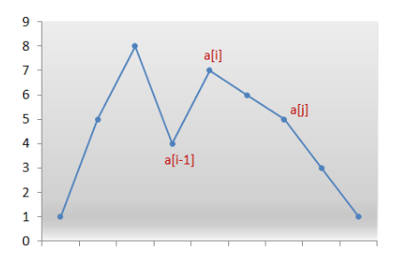

@[Toc]
 
# 一、有效的括号(leetcode-20)
## 问题描述
给定一个只包括 '('，')'，'{'，'}'，'['，']' 的字符串，判断字符串是否有效。
有效字符串需满足：
左括号必须用相同类型的右括号闭合。
左括号必须以正确的顺序闭合。
注意空字符串可被认为是有效字符串。
## 示例
示例 1:
输入: "()"
输出: true

示例 2:
输入: "()[]{}"
输出: true

示例 3:
输入: "(]"
输出: false

示例 4:
输入: "([)]"
输出: false

示例 5:
输入: "{[]}"
输出: true

## 解法分析
很容易想到用**栈**来进行实现，遇到左括号就将其入栈，遇到右括号就比较栈顶元素是否为对应的左括号，是则将其出栈继续判断下一个字符，不是则返回不匹配。
(注：可以用hsahmap将右括号作为key，对应的左括号作为value来方便进行后续的判断)
## 代码实现
```
public class Solution_20 {
	static Map<Character, Character> map = new HashMap<Character, Character>();
	public static void main(String[] args) {
		 map.put(')', '(');
		 map.put(']', '[');
		 map.put('}', '{');
		 String string = "()[]{}";
		 System.out.println(isValid(string));
	}
	public static boolean isValid(String s) {
		Stack<Character> stack = new Stack<Character>(); //创建栈用于存取字符
		
		for(int i = 0 ; i < s.length() ; i++) { //遍历字符串s中
			char c = s.charAt(i); //取出当前字符
			if(map.containsKey(c)) { //如果当前字符是右括号中的一个，将栈顶元素取出与其对应左括号对比
				char temp = stack.isEmpty() ? '#' : stack.pop();
				if(temp != map.get(c)) { //如果不匹配，返回false
					return false;
				}
			}else {
				stack.push(c); //如果是左括号，将其压入栈中
			}
		}
		return stack.isEmpty(); //返回栈是否为空，为空说明匹配成功
	}
}
```
# 二、合并两个有序的链表(leetcode-21)
## 问题描述
将两个升序链表合并为一个新的升序链表并返回。新链表是通过拼接给定的两个链表的所有节点组成的。 

## 示例
输入：1->2->4, 1->3->4
输出：1->1->2->3->4->4

## 解法分析
本题可以考虑**递归**实现，递归结束条件为l1或l2其中一个节点全部取完，就返回另一个链表。每次递归时取一个较小的节点进行连接。

## 代码实现
```
	public static ListNode mergeTwoLists(ListNode l1, ListNode l2) {
		//其中一个链表的指针指向为空时，递归终止
		if (l1 == null) {
			return l2; 
		}
		if (l2 == null) {
			return l1;
		}
		//画图较为容易理解，相当于每次取一个较小的节点连接起来
		if (l1.val < l2.val) {
			l1.next = mergeTwoLists(l1.next, l2);
			return l1;
		} else {
			l2.next = mergeTwoLists(l1, l2.next);
			return l2;
		}
	 }
```
# 三、括号生成(leetcode-22)
## 问题描述
给出 n 代表生成括号的对数，请你写出一个函数，使其能够生成所有可能的并且有效的括号组合。

## 示例
例如，给出 n = 3，生成结果为：

[
  "((()))",
  "(()())",
  "(())()",
  "()(())",
  "()()()"
]

## 解法分析
(1):**暴力法**：生成所有可能的序列，再判断其是否有效
(2):**回溯法**：对于某一个中间字符串s来说，如果它包含的左括号数小于n，则可以开始添加一个左括号保证其有效，当他的右括号数小于左括号数，则应添加一个右括号来
保证其有效。
(3):**闭包法**：类似于动态规划寻找dp[i+1]与dp[i]的关系。

## 代码实现
回溯法代码实现
```
	public static List<String> generateParenthesis(int n) {
		List<String> ans = new ArrayList<String>();
		backtrack(ans, "", 0, 0, n);
		return ans;
	}
	//回溯函数，通过该函数生成所有可能结果并将其存入结果列表中
	public static void backtrack(List<String> ans, String cur, int open, int close, int max) {
		if(cur.length() == max*2) {
			ans.add(cur);
			return ; 
		}
		if(open < max) {
			backtrack(ans, cur+"(", open+1, close, max);
		}
		if(close < open) {
			backtrack(ans, cur+")", open, close+1, max);
		}
	}
```
闭包法代码实现：
```
	public List<String> generateParenthesis(int n) {
        List<String> ans = new ArrayList();
        if (n == 0) {
            ans.add("");
        } else {
            for (int c = 0; c < n; ++c)
                for (String left: generateParenthesis(c))
                    for (String right: generateParenthesis(n-1-c))
                        ans.add("(" + left + ")" + right);
        }
        return ans;
    }
```
# 四、合并k个排序链表(leetcode-23)
## 问题描述
合并 k 个排序链表，返回合并后的排序链表。请分析和描述算法的复杂度。
## 示例
输入:
[
  1->4->5,
  1->3->4,
  2->6
]
输出: 1->1->2->3->4->4->5->6

## 解法分析
因为之前做过两个有序链表合并的题目，所以这里可以采用分治的思想，将链表两两分组合并，考虑奇数情况即可。

## 代码实现
```
	public static ListNode mergeKLists(ListNode[] lists) {
        int len = lists.length;//每次待处理的链表个数
        if(len==0)return null;//处理null

        while(len>1){
            int i;
            //两两合并，注意到这里将位置2i与2i+1的两个链表合并到位置i上。
            //如有不清楚的可以自己画个数组看看
            for( i = 0;i <len/2;i++){
                lists[i]=mergeTwoLists(lists[2*i],lists[2*i+1]) ;  
            }
            //处理奇数的情况。把最后一个链表放到下次待求解数组的末端，顺便解决向上取整的问题
            if((len%2)!=0){
                lists[i]=lists[len-1];
                len++;
            }

            //规模减半
            len/=2;

        }

        return lists[0];
    }

	public static ListNode mergeTwoLists(ListNode l1, ListNode l2) {
		//其中一个链表的指针指向为空时，递归终止
		if (l1 == null) {
			return l2; 
		}
		if (l2 == null) {
			return l1;
		}
		//画图较为容易理解，相当于每次取一个较小的节点连接起来
		if (l1.val < l2.val) {
			l1.next = mergeTwoLists(l1.next, l2);
			return l1;
		} else {
			l2.next = mergeTwoLists(l1, l2.next);
			return l2;
		}
	 }
```
# 五、下一个排列(leetcode-31)
## 问题描述
实现获取下一个排列的函数，算法需要将给定数字序列重新排列成字典序中下一个更大的排列。
如果不存在下一个更大的排列，则将数字重新排列成最小的排列（即升序排列）。
必须原地修改，只允许使用额外常数空间。

## 示例
1,2,3 → 1,3,2
3,2,1 → 1,2,3
1,1,5 → 1,5,1

## 解法分析

我们的目标就是找到对应的a[i-1]和a[j]将其交换后然后将a[i-1]右边的所有元素逆序即可得到答案。

## 代码实现
```
	public static void nextPermutation(int[] nums) {
        int i = nums.length - 2;
        while (i >= 0 && nums[i + 1] <= nums[i]) {
            i--; //找到i-1的点使得nums[i-1] > nums[i]
        }
        if (i >= 0) {
            int j = nums.length - 1;
            while (j >= 0 && nums[j] <= nums[i]) {
                j--; //找到右边数组第一个比nums[i]大的点
            }
            swap(nums, i, j); //交换两者位置
        }
        reverse(nums, i + 1); //将后面的递减序列转换为递增数列
    }

    private static void reverse(int[] nums, int start) {
        int i = start, j = nums.length - 1;
        while (i < j) {
            swap(nums, i, j);
            i++;
            j--;
        }
    }

    private static void swap(int[] nums, int i, int j) {
        int temp = nums[i];
        nums[i] = nums[j];
        nums[j] = temp;
    }
```