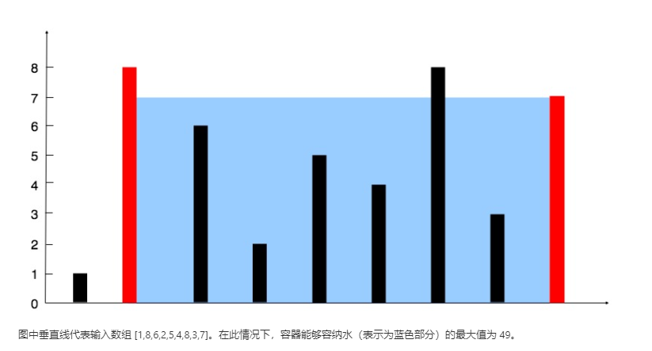
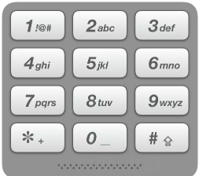

@[Toc]

# 一、正则表达式匹配(leetcode-10)
## 问题描述
给你一个字符串 s 和一个字符规律 p，请你来实现一个支持 '.' 和 '*' 的正则表达式匹配。
'.' 匹配任意单个字符
'*' 匹配零个或多个前面的那一个元素
所谓匹配，是要涵盖 整个 字符串 s的，而不是部分字符串。

## 示例
示例一：
输入:
s = "aa"
p = "a"
输出: false
解释: "a" 无法匹配 "aa" 整个字符串

示例二：
输入:
s = "aa"
p = "a*"
输出: true
解释: 因为 '*' 代表可以匹配零个或多个前面的那一个元素, 在这里前面的元素就是 'a'。因此，字符串 "aa" 可被视为 'a' 重复了一次。

示例三：
输入:
s = "ab"
p = ".*"
输出: true
解释: ".*" 表示可匹配零个或多个（'*'）任意字符（'.'）。

示例四：
输入:
s = "aab"
p = "c*a*b"
输出: true
解释: 因为 '*' 表示零个或多个，这里 'c' 为 0 个, 'a' 被重复一次。因此可以匹配字符串 "aab"。

示例五：
输入:
s = "mississippi"
p = "mis*is*p*."
输出: false

## 解法分析
(1):**回溯法**：其实就是不断去掉s和p可以匹配的字符串首部，当一个或两个字符串减为空时，根据结果进行判断。具体需要划分为以下几种情况：
1、s和p都为普通字符串时，按序遍历比较即可
```
if( s.charAt(i) == p.charAt(i) )
```
2、p中只含有'.'一种特殊标记时，也是按序比较，只是在判断时需要多加上一种情况
```
if( s.charAt(i) == p.charAt(i) || p.charAt(i) == '.' )
```
3、p中含有'*'这种特殊标记时，问题略微复杂，假设p的第i个元素下一个为'*'，则有以下两种情况：
3.1：s和p第i位不匹配，则p的第i位应该出现0次，此时应该p减去i和下一位'*'，再进行匹配。
3.2：s和p第i位匹配，则可以将s减去一个首字符，此时再进行匹配至**3.1**情况出现即可

(2):**动态规划法**：此题使用动态规划的话，dp数组的含义就是：dp[i][j]就是s的前i个元素是否可以被p的前j个元素所匹配。初始化时dp[0][0]应该为true，
dp[1][0]~dp[length][0]应该为false，且dp[0][1]也应该为false。状态转移时，可以参考第一种解法，回溯法的转移过程。相比于回溯法，这种方法在下标处理
时需要更加细心。

## 代码实现
回溯法代码如下：
```
	public static boolean isMatch(String s, String p) {
		//如果正则串p为空字符串s也为空这匹配成功，如果正则串p为空但是s不是空则说明匹配失败
	    if (p.isEmpty())return s.isEmpty();
	    //判断s和p的首字符是否匹配，注意要先判断s不为空
	    boolean headMatched=!s.isEmpty()&&(s.charAt(0)==p.charAt(0)||p.charAt(0)=='.');
	    if (p.length()>=2&&p.charAt(1)=='*'){//如果p的第一个元素的下一个元素是*
	        //则分别对两种情况进行判断
	        return isMatch(s,p.substring(2))||
	            (headMatched&&isMatch(s.substring(1),p));
	    }else if (headMatched){//否则，如果s和p的首字符相等
	        return isMatch(s.substring(1),p.substring(1));
	    }else {
	        return false;
	    }
	}
```
动态规划代码实现如下：
```
	public static boolean isMatch(String s, String p) {
		//需要分别取出s和p为空的情况，所以dp数组大小+1
	    boolean[][] dp=new boolean[s.length()+1][p.length()+1];
	    //初始化dp[0][0]=true,dp[0][1]和dp[1][0]~dp[s.length][0]默认值为false所以不需要显式初始化
	    dp[0][0]=true;
	    //填写第一行dp[0][2]~dp[0][p.length]
	    for (int k=2;k<=p.length();k++){
	        //p字符串的第2个字符是否等于'*',此时j元素需要0个，所以s不变p减除两个字符
	        dp[0][k]=p.charAt(k-1)=='*'&&dp[0][k-2];
	    }
	    //填写dp数组剩余部分
	    for (int i=0;i<s.length();i++){
	        for (int j=0;j<p.length();j++){
	            //p第j个字符是否为*
	            if (p.charAt(j)=='*'){
	                //两种情况:1.s不变[i+1],p移除两个元素[j+1-2]。
	                // 2.比较s的i元素和p的j-1(因为此时j元素为*)元素,相等则移除首元素[i+1-1],p不变。
	                dp[i+1][j+1]=dp[i+1][j-1]||
	                    (dp[i][j+1]&&headMatched(s,p,i,j-1));
	            }else {
	                //s的i元素和p的j元素是否相等,相等则移除s的i元素[i+1-1]和p的j元素[j+1-1]
	                dp[i+1][j+1]=dp[i][j]&&headMatched(s,p,i,j);
	            }
	        }
	    }
	    return dp[s.length()][p.length()];
	}
	//判断s第i个字符和p第j个字符是否匹配
	public static boolean headMatched(String s,String p,int i,int j){
	    return s.charAt(i)==p.charAt(j)||p.charAt(j)=='.';
	}
```
# 二、盛最多水的容器(leetcode-11)
## 问题描述
给你 n 个非负整数 a1，a2，...，an，每个数代表坐标中的一个点 (i, ai) 。在坐标内画 n 条垂直线，垂直线 i 的两个端点分别为 (i, ai) 和 (i, 0)。找出其中的两条线，使得它们与 x 轴共同构成的容器可以容纳最多的水。
说明：你不能倾斜容器，且 n 的值至少为 2。

## 示例

输入：[1,8,6,2,5,4,8,3,7]
输出：49

## 解法分析
(1)：**暴力法**：直接遍历所有可能的线段组合，用maxarea保存最大值并返回。
(2)：**双指针法**：用首尾两个指针，初始时指向0和length-1位置，每次移动两个指针中较低那条，这样才有可能得到更大的区域。

## 代码实现
双指针法实现：
```
	public static int maxArea(int[] height) {
		int maxarea = 0; //用于保存最大盛雨水量
		int start = 0; //头指针
		int end = height.length-1; //尾指针
		while(start < end) {
			maxarea = Math.max(maxarea, Math.min(height[start], height[end])* (end - start)); //更新最大盛雨水量
			if(height[start] <= height[end]) { //移动更矮的一边
				start++;
			}else {
				end--;
			}
		}
		return maxarea;
    }
```

# 三、三数之和(leetcode-15)
## 问题描述
给你一个包含 n 个整数的数组 nums，判断 nums 中是否存在三个元素 a，b，c ，使得 a + b + c = 0 ？请你找出所有满足条件且不重复的三元组。
注意：答案中不可以包含重复的三元组。

## 示例
给定数组 nums = [-1, 0, 1, 2, -1, -4]，

满足要求的三元组集合为：
[
  [-1, 0, 1],
  [-1, -1, 2]
]

## 解法分析
本题可以调用数组排序函数将数组排序后，再使用**双指针法**进行求解。对于当前nums[i]，如果其值大于0，则与其后两个数相加肯定大于0，可以直接
跳出循环；如果nums[i]和nums[i-1]相等，就要考虑直接进行下一次循环进行去重处理。我们可以用sum保存三元组的和，其等于0时，将三元组添加到解的
list里，同时要考虑去重；sum<0时，start++；sum>0时，end--即可。

## 代码实现
```
	public static List<List<Integer>> threeSum(int[] nums) {
		List<List<Integer>> ans = new ArrayList(); //用于保存结果
		int len = nums.length;
		if(nums == null || len < 3) {
			return ans;
		}
		Arrays.sort(nums);
		//System.out.println(Arrays.toString(nums));
		for(int i = 0 ; i < len ; i++) {
			if(nums[i] > 0) { //如果当前的nums[i]大于0，直接跳出循环
				break;
			}
			if(i > 0 && nums[i] == nums[i-1]) {
				continue; //与上一个元素相等，继续下一次循环去重
			}
			int l = i+1;
			int r = len-1;
			while(l<r) {
				int sum = nums[i]+nums[l]+nums[r];
				if(sum == 0) {
					ans.add(Arrays.asList(nums[i],nums[l],nums[r]));
					while(l<r && nums[l] == nums[l+1]) {
						l++;//去重
					}
					while(l<r && nums[r] == nums[r-1]) {
						r--;//去重
					}
					l++;
					r--;
				}else if(sum > 0) {
					r--;
				}else if(sum < 0){
					l++;
				}
			}
		}
		return ans;
	}
```

# 四、电话号码的数字组合(leetcode-17)
## 问题描述
给定一个仅包含数字 2-9 的字符串，返回所有它能表示的字母组合。
给出数字到字母的映射如下（与电话按键相同）。注意 1 不对应任何字母。


## 示例
输入："23"
输出：["ad", "ae", "af", "bd", "be", "bf", "cd", "ce", "cf"].

## 解法分析
**回溯法**：使用一个函数，将当前已经产生的组合和接下来要传入的数字作为参数进行组合，如果没有接下来的数字需要输入，说明生成完毕。

## 代码实现
用HashMap保存数字对应的字符
```
	static Map<String,String> phone = new HashMap<String, String>(){{
			put("2", "abc");
			put("3", "def");
			put("4", "ghi");
			put("5", "jkl");
			put("6", "mno");
			put("7", "pqrs");
			put("8", "tuv");
			put("9", "wxyz");
		}
	};
```
用ArrayList保存结果列表
```
static List<String> output = new ArrayList<String>();
```
回溯核心代码
```
	/**
	 * 回溯函数
	 * @param combination 当前产生组合
	 * @param next_digits 下一个输入的数字
	 */
	public static void backtrack(String combination,String next_digits) {
		if(next_digits.length() == 0) { //下一个数字为空，存储当前组合
			output.add(combination);
		}else {
			String digit = next_digits.substring(0,1); //得到下一个数字
			String letters = phone.get(digit); //得到下一个数字对应的字符
			for(int i = 0; i < letters.length() ; i++) { //遍历得到所有组合结果并进行下一次回溯
				String letter = phone.get(digit).substring(i, i + 1);
				 backtrack(combination + letter, next_digits.substring(1));
			}
		}
		
	}
	
	public static List<String> letterCombinations(String digits) {
		 if (digits.length() != 0)
		      backtrack("", digits); //初次回溯入口
		 return output;
	}
```
# 五、删除链表的倒数第N个节点(leetcode-19)
## 问题描述
给定一个链表，删除链表的倒数第 n 个节点，并且返回链表的头结点。

## 示例
给定一个链表: 1->2->3->4->5, 和 n = 2.
当删除了倒数第二个节点后，链表变为 1->2->3->5.

## 解法分析
本题可以采用**双指针法**，用一个快指针和一个慢指针来进行实现，快指针先走n步，然后慢指针开始行动，等到快指针走到链表尾部时，删除慢指针此时指向的
下一个元素即可。

## 代码实现
```
	public static ListNode removeNthFromEnd(ListNode head, int n) {
		ListNode pre = new ListNode(0); //声明pre指向链表头节点最后用于返回
		pre.next = head;
		ListNode start = pre, end = pre; //声明快指针start和慢指针end
		while (n != 0) { //快指针先走n步
			start = start.next;
			n--;
		}
		while (start.next != null) { //快慢指针在快指针没走到头时一起迁移
			start = start.next;
			end = end.next;
		}
		end.next = end.next.next; //删除此时end指针指向的下一个节点
		return pre.next; //返回链表头指针
	}
```

# 总结
今天是第二天写博客，效率比起昨天高了不少，通过写博客对自己的思路进行整理或对他人的解答进行理解和实现，让我对算法题目的理解更为印象深刻，也给自己
提供了很好的复习渠道，希望与想要提高算法能力的小伙伴一起加油把~