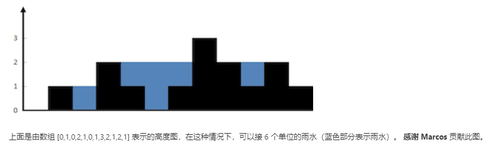

@[Toc]

# 一、最长有效括号(leetcode-32)
## 问题描述
给定一个只包含 '(' 和 ')' 的字符串，找出最长的包含有效括号的子串的长度。
## 示例
示例 1:
输入: "(()"
输出: 2
解释: 最长有效括号子串为 "()"

示例 2:
输入: ")()())"
输出: 4
解释: 最长有效括号子串为 "()()"

## 解法分析
(1):**暴力法**：对字符串所有非空偶数长度子字符串判断其是否为有效括号。
(2):**动态规划**：定义一个dp数组，其中dp[i]表示以下标i为字符串结尾的字符串的最长有效括号长度，显然可以知道'('结尾的位置dp[i]应该为0，所以只用考虑')'
的情况，此时又分两种情况：1、')'前面的字符是'(',这种情况比较简单dp[i] = dp[i-2] + 2即可；2、')'前面的字符也为')'时，那么字符串就可能是'.....))'的形式
此时我们往前找到一个s[i-dp[i-1]-1] = '(',此时可以得出dp[i]=dp[i−1]+dp[i−dp[i−1]−2]+2。
(3):**栈**：此题可用栈经过一次遍历得到答案，创建一个栈之后将-1入栈，对于遇到的每个 '('，我们将它的下标放入栈中。对于遇到的每个')'，我们弹出栈顶的元素并
将当前元素的下标与弹出元素下标作差，得出当前有效括号字符串的长度。通过这种方法，我们继续计算有效子字符串的长度，并最终返回最长有效子字符串的长度。

## 代码实现
动态规划：
```
	public static int longestValidParentheses(String s) {
        int maxans = 0; //创建变量用于保存最长有效括号
        int dp[] = new int[s.length()]; //1、状态定义
        for (int i = 1; i < s.length(); i++) { 
            if (s.charAt(i) == ')') { //状态转移
                if (s.charAt(i - 1) == '(') {
                    dp[i] = (i >= 2 ? dp[i - 2] : 0) + 2;
                } else if (i - dp[i - 1] > 0 && s.charAt(i - dp[i - 1] - 1) == '(') {
                    dp[i] = dp[i - 1] + ((i - dp[i - 1]) >= 2 ? dp[i - dp[i - 1] - 2] : 0) + 2;
                }
                maxans = Math.max(maxans, dp[i]);
            }
        }
        return maxans;
    }
```
栈
```
	public static int longestValidParentheses(String s) {
		 int maxans = 0; //创建变量用于保存最大长度
	     Stack<Integer> stack = new Stack<>(); //创建栈
	     stack.push(-1); //先将-1压入栈中
	     for (int i = 0; i < s.length(); i++) {
	        if (s.charAt(i) == '(') { //对于遇到的'('，将其下标放入栈中
	            stack.push(i);
	        } else {
	            stack.pop(); //遇到')'，则将栈顶元素出栈
	            if (stack.empty()) { //如果栈为空，则把当前元素下标存入栈中
	                stack.push(i);
	            } else {
	                maxans = Math.max(maxans, i - stack.peek()); //更新最大长度
	            }
	        }
	     }
	     return maxans;
    }
```

# 二、搜索旋转排序数组(leetcode-33)
## 问题描述
假设按照升序排序的数组在预先未知的某个点上进行了旋转。
( 例如，数组 [0,1,2,4,5,6,7] 可能变为 [4,5,6,7,0,1,2] )。
搜索一个给定的目标值，如果数组中存在这个目标值，则返回它的索引，否则返回 -1 。
你可以假设数组中不存在重复的元素。
你的算法时间复杂度必须是 O(log n) 级别。

## 示例
示例 1:
输入: nums = [4,5,6,7,0,1,2], target = 0
输出: 4

示例 2:
输入: nums = [4,5,6,7,0,1,2], target = 3
输出: -1

## 解法分析
因为题目要求时间复杂度为O(log n)级别，所以可以想到是用二分查找进行解决，一个无重复元素的旋转排序数组有两种情况，一是首位元素大于中位元素，这样数组后半部分
有序，然后比较target与中位元素大小再确定查找区间，另一种情况类似。

## 代码实现
```
	public static int search(int[] nums, int target) {
		if(nums == null || nums.length == 0) {
			return -1;
		}
		int start = 0;
		int end = nums.length-1;
		int mid;
		while(start <= end) {
			mid = start + (end - start) / 2;
			if(nums[mid] == target) {
				return mid;
			}
			//前半部分有序时
			if(nums[start] <= nums[mid]) {
				//target在前半部分时
				if(target >= nums[start] && target < nums[mid]) {
					end = mid-1;
				}else {
					start = mid+1;
				}
			}else {//后半部分有序时
				//target在后半部分时
				if(target <= nums[end] && target > nums[mid]) {
					start = mid + 1;
				}else {
					end = mid - 1;
				}
			}
		}
		return -1;
	}
```

# 三、在排序数组中查找元素第一个和最后一个位置(leetcode-34)
## 问题描述
给定一个按照升序排列的整数数组 nums，和一个目标值 target。找出给定目标值在数组中的开始位置和结束位置。
你的算法时间复杂度必须是 O(log n) 级别。

## 示例
示例 1:
输入: nums = [5,7,7,8,8,10], target = 8
输出: [3,4]

示例 2:
输入: nums = [5,7,7,8,8,10], target = 6
输出: [-1,-1]

## 解法分析
本题如上题依旧采用二分查找的方法，不过在遇到元素等于target时不是直接返回，而是不断向左或者向右移动得到左右边界再进行返回。

## 代码实现
```
	public static int[] searchRange(int[] nums, int target) {
		if(nums==null) {
			return new int[]{-1,-1};
		}
		int firstIndex = find(true,nums,target);
		int lastIndex = find(false,nums,target);
		return new int[]{firstIndex,lastIndex};
	}
	
	//查找第一个和最后一个元素
	private static int find(boolean isFindFirst,int[] nums,int target) {
		int begin = 0;
		int end = nums.length-1;
		//if和else if的逻辑跟正常的二分查找一样
		while(begin<=end) {
			int mid = begin+(end-begin)/2;
			if(nums[mid]>target) {
				end = mid-1;
			}
			else if(nums[mid]<target) {
				begin = mid+1;
			}
			//找到目标值了，开始定位到第一个和最后一个位置
			else {
				//查找第一个和最后一个逻辑很类似，这里用一个变量标记
				//是查找第一个还是查找最后一个
				if(isFindFirst) {
					//如果不满足条件，缩小右边界，继续往左边查找
					if(mid>0 && nums[mid]==nums[mid-1]) {
						end = mid-1;
					} else {
						return mid;
					}
				}
				else {
					//如果不满足条件，增大左边界，继续往右边查找
					if(mid<nums.length-1 && nums[mid]==nums[mid+1]) {
						begin = mid+1;
					} else {
						return mid;
					}
				}
			}
		}
		return -1;
	}
```
# 四、组合总和(leetcode-39)
## 问题描述
给定一个无重复元素的数组 candidates 和一个目标数 target ，找出 candidates 中所有可以使数字和为 target 的组合。
candidates 中的数字可以无限制重复被选取。

说明：
所有数字（包括 target）都是正整数。
解集不能包含重复的组合。 

## 示例
示例 1:
输入: candidates = [2,3,6,7], target = 7,
所求解集为:
[
  [7],
  [2,2,3]
]

示例 2:
输入: candidates = [2,3,5], target = 8,
所求解集为:
[
  [2,2,2,2],
  [2,3,3],
  [3,5]
]

## 解法分析
这种找多解的问题感觉一般都是通过回溯实现，对目标值做减法，分别减去数组中元素再进行回溯，得到叶子节点后根据叶子节点判断是否加入结果集。

## 代码实现
```
	public List<List<Integer>> combinationSum(int[] candidates, int target) {
        List<List<Integer>> res = new ArrayList<>();
        int len = candidates.length;

        // 排序是为了提前终止搜索
        Arrays.sort(candidates);

        dfs(candidates, len, target, 0, new ArrayDeque<>(), res);
        return res;
    }

    /**
     * @param candidates 数组输入
     * @param len        输入数组的长度，冗余变量
     * @param residue    剩余数值
     * @param begin      本轮搜索的起点下标
     * @param path       从根结点到任意结点的路径
     * @param res        结果集变量
     */
    private void dfs(int[] candidates,
                     int len,
                     int residue,
                     int begin,
                     Deque<Integer> path,
                     List<List<Integer>> res) {
        if (residue == 0) {
            // 由于 path 全局只使用一份，到叶子结点的时候需要做一个拷贝
            res.add(new ArrayList<>(path));
            return;
        }

        for (int i = begin; i < len; i++) {

            // 在数组有序的前提下，剪枝
            if (residue - candidates[i] < 0) {
                break;
            }

            path.addLast(candidates[i]);
            dfs(candidates, len, residue - candidates[i], i, path, res);
            path.removeLast();

        }
    }
```

# 五、接雨水(leetcode-42)
## 问题描述
给定 n 个非负整数表示每个宽度为 1 的柱子的高度图，计算按此排列的柱子，下雨之后能接多少雨水。


## 示例

示例:
输入: [0,1,0,2,1,0,1,3,2,1,2,1]
输出: 6

## 解法分析
**单调栈**：维护一个递归的单调栈（具体详解如下：[](https://leetcode-cn.com/problems/trapping-rain-water/solution/dan-diao-zhan-jie-jue-jie-yu-shui-wen-ti-by-sweeti/)）

## 代码实现
```
	public int trap(int[] height) {
        if (height == null) {
            return 0;
        }
        Stack<Integer> stack = new Stack<>();
        int ans = 0;
        for (int i = 0; i < height.length; i++) {
            while(!stack.isEmpty() && height[stack.peek()] < height[i]) {
                int curIdx = stack.pop();
                // 如果栈顶元素一直相等，那么全都pop出去，只留第一个。
                while (!stack.isEmpty() && height[stack.peek()] == height[curIdx]) {
                    stack.pop();
                }
                if (!stack.isEmpty()) {
                    int stackTop = stack.peek();
                    // stackTop此时指向的是此次接住的雨水的左边界的位置。右边界是当前的柱体，即i。
                    // Math.min(height[stackTop], height[i]) 是左右柱子高度的min，减去height[curIdx]就是雨水的高度。
                    // i - stackTop - 1 是雨水的宽度。
                    ans += (Math.min(height[stackTop], height[i]) - height[curIdx]) * (i - stackTop - 1);
                }
            }
            stack.add(i);
        }
        return ans;
    }
```

# 总结
这次五个题感觉难度都比较大，不过从中也获得了不少的收获，看了看一些优秀的题解和分析，对二分查找这种算法左右边界的寻找有了更深的理解。而且看了多种思路
的解法后我感觉栈这种数据结构在算法中有很多妙用，在以后刷题过程中需要多多总结。